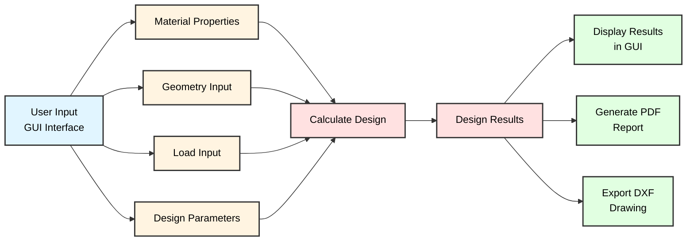

# 🏗️ Stairway Designer Pro - NSCP 2015 Concrete Stairway Design

<div align="center">

**Automate Your Structural Analysis Workflow**

*Developed by* **Engr. Lowrence Scott D. Gutierrez**  
[](https://www.linkedin.com/in/lsdg)

---

### 📊 Repository Stats

  
  

---

**Transform hours of manual stairway design calculations into seconds with a modern GUI application.**

</div>

---

## ✨ What Makes This Special

This intelligent Python desktop application revolutionizes how structural engineers design concrete stairways. Fully compliant with **NSCP 2015 standards**, it provides an intuitive graphical interface for designing single or double-flight stairways—complete with professional PDF reports, AutoCAD-compatible DXF drawings, and comprehensive reinforcement schedules—eliminating human error and saving valuable engineering time.

Whether you're designing residential staircases, commercial buildings, or industrial facilities, this modern tkinter-based application processes your design parameters through validated calculations, generating code-compliant designs with detailed documentation and technical drawings instantly.

---

## 🚀 Key Features

<table>
<tr>
<td width="50%">

### 🎨 **Modern GUI Interface**
- Professional dark-themed interface
- Intuitive card-based layout
- Real-time input validation
- Scrollable design panels

### 📋 **Comprehensive Design Options**
- Single or double-flight configurations
- Multiple support conditions
- Custom material properties
- Adjustable reinforcement parameters

</td>
<td width="50%">

### 🎯 **NSCP 2015 Compliant**
- Ultimate strength design method
- Proper load combinations (1.2DL + 1.6LL)
- Steel ratio verification (ρ_min, ρ_max)
- Temperature reinforcement calculations

### 🛡️ **Professional Outputs**
- PDF design reports with tables
- AutoCAD DXF drawings (section, plan, details)
- Reinforcement schedules
- Complete calculation documentation

</td>
</tr>
</table>

---

## 📁 Application Architecture

```
📂 StairwayDesignerPro/
│
├── 🎨 stairway_designer.py         # Main application file
│   ├── ModernStairwayDesigner      # Main GUI class
│   ├── PDFGenerator                # Professional report generator
│   ├── StairwayDXFGenerator        # CAD drawing exporter
│   └── Data classes:
│       ├── MaterialProperties      # Material strength parameters
│       ├── GeometricProperties     # Stairway dimensions
│       ├── LoadProperties          # Service loads
│       └── DesignParameters        # Reinforcement specifications
│
├── 📄 requirements.txt              # Python dependencies
├── 📖 README.md                     # This file
│
└── 📊 outputs/                      # Generated files
    ├── stairway_design_report.pdf  # Professional PDF report
    └── stairway_drawing.dxf        # AutoCAD drawing
```

---

## 🔄 Application Workflow



---

## 🔧 Prerequisites

### **System Requirements**
- ✅ **Python 3.8+** installed
- ✅ **Operating System:** Windows, macOS, or Linux
- ✅ **Display Resolution:** Minimum 1280x720

### **Required Python Libraries**
```bash
tkinter              # Built-in: GUI framework
reportlab>=3.6.0     # PDF generation
ezdxf>=0.17.0        # DXF drawing export (optional)
dataclasses          # Built-in: Data structures
math                 # Built-in: Mathematical operations
datetime             # Built-in: Date/time handling
```

### **Knowledge Prerequisites**
- ✅ Basic understanding of concrete stairway design
- ✅ Familiarity with NSCP 2015 requirements
- ✅ Understanding of structural loads and support conditions

---

## 📖 Getting Started

### **Step 1: Clone the Repository**

```bash
# Clone via Git
git clone https://github.com/SC0L0W/StairwayDesignerPro.git
cd StairwayDesignerPro

# Or download as ZIP and extract
```

---

### **Step 2: Install Dependencies**

```bash
# Create virtual environment (recommended)
python -m venv venv

# Activate virtual environment
# Windows:
venv\Scripts\activate
# macOS/Linux:
source venv/bin/activate

# Install required packages
pip install -r requirements.txt
```

**requirements.txt:**
```
reportlab>=3.6.0
ezdxf>=0.17.0
```

---

### **Step 3: Launch the Application**

```bash
# Run the main application
python stairway_designer.py
```

#### **Application Launch Screen:**

```
╔══════════════════════════════════════════════════════════╗
║                                                          ║
║          🏗️ Stairway Designer Pro                       ║
║                                                          ║
║   NSCP 2015 Compliant Concrete Stairway Design Tool     ║
║                                                          ║
╚══════════════════════════════════════════════════════════╝

[Application Window Opens]
```

---

## 🎨 User Interface Guide

### **Main Interface Layout**

The application features a **modern card-based design** with two main panels:

#### **Left Panel (60%) - Input Section**
Scrollable cards for entering design parameters:

1. **🧱 Material Properties Card**
   - Concrete strength (f'c)
   - Steel yield strength (fy)
   - Concrete unit weight (γ)
   - Beta factor (β₁)

2. **⚙️ Reinforcement Bars Card**
   - Main bar diameter
   - Temperature bar diameter
   - Hook bar diameter
   - Concrete cover

3. **📦 Service Loads Card**
   - Live load
   - Miscellaneous live load
   - Floor finish load
   - Miscellaneous dead load

4. **📐 Geometry Card**
   - Tread width
   - Riser height
   - Clear span
   - Number of steps (1st & 2nd flight)

5. **🔧 Support Configuration Card**
   - First flight support type
   - Second flight support type
   - Options:
     * Two-point support with stringers
     * One-end supported (cantilever)
     * Open support (floating)

6. **📏 Slab Thickness Card**
   - Use proposed thickness option
   - Custom thickness input

7. **⚡ Design Options Card**
   - Design only first flight checkbox

8. **Action Buttons**
   - 🚀 Calculate Design
   - 📄 Generate PDF
   - 📐 Export DXF
   - 🗑️ Clear

#### **Right Panel (40%) - Results Section**
- **📊 Design Results** display area
- Real-time calculation output
- Formatted text with comprehensive details

---

## 💻 Using the Application

### **Step-by-Step Design Process**

#### **1. Enter Material Properties**

```
Material Properties Card:
┌─────────────────────────────────────────┐
│ 🧱 Material Properties
